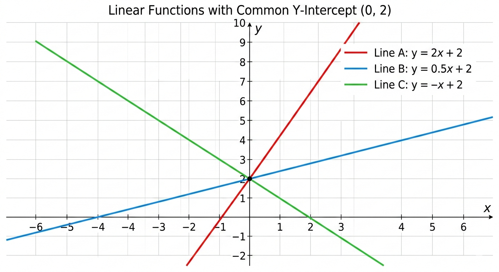
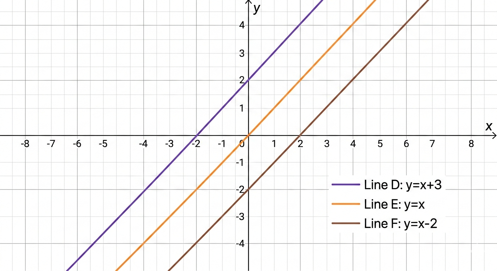

# Understanding the Linear Equation: \( y = mx + c \)

This document explains the fundamental equation of a straight line, \( y = mx + c \), its parameters, and how they influence the line's behavior. This equation is the backbone of linear regression and many other modeling techniques.

---

## 1. The Equation

The standard form of a linear equation in two variables is:

\[
y = mx + c
\]

where:
- \(x\) is the **independent variable** (input)
- \(y\) is the **dependent variable** (output)
- \(m\) is the **slope** (gradient) of the line
- \(c\) is the **y‑intercept** (the value of \(y\) when \(x = 0\))

This equation describes a straight line when plotted on a Cartesian plane.

---

## 2. Parameter \(m\) – The Slope

### What is the slope?

The slope \(m\) measures the **steepness** and **direction** of the line. It is defined as the ratio of the vertical change to the horizontal change between any two points on the line:

\[
m = \frac{\Delta y}{\Delta x} = \frac{y_2 - y_1}{x_2 - x_1}
\]

- If \(m > 0\), the line rises as \(x\) increases (positive relationship).
- If \(m < 0\), the line falls as \(x\) increases (negative relationship).
- If \(m = 0\), the line is horizontal (no relationship).

### Effect of changing \(m\)

The slope determines how steep the line is.

- **Large positive \(m\)** (e.g., \(m = 5\)): the line rises steeply.
- **Small positive \(m\)** (e.g., \(m = 0.5\)): the line rises gently.
- **Negative \(m\)**: the line slopes downward.

#### Graphical Illustration

Imagine three lines with intercept fixed at \(c = 2\):

```
y = 2x + 2   (m = 2)
y = 0.5x + 2 (m = 0.5)
y = -x + 2   (m = -1)
```


*(conceptual)*

- **m = 2**: line climbs quickly.
- **m = 0.5**: line climbs slowly.
- **m = -1**: line descends.

---

## 3. Parameter \(c\) – The Intercept

### What is the intercept?

The intercept \(c\) is the value of \(y\) when \(x = 0\). It tells us where the line crosses the **y‑axis**.

### Effect of changing \(c\)

Changing \(c\) shifts the line **vertically** without altering its slope.

- **Increasing \(c\)** moves the line upward.
- **Decreasing \(c\)** moves the line downward.

#### Graphical Illustration

Consider lines with fixed slope \(m = 1\) and different intercepts:

```
y = x + 3   (c = 3)
y = x       (c = 0)
y = x - 2   (c = -2)
```


*(conceptual)*

All lines are parallel (same slope), but they cross the y‑axis at different points:  
- \(c = 3\) at \(y = 3\)  
- \(c = 0\) at the origin  
- \(c = -2\) at \(y = -2\)

---

## 4. Combined Effect of \(m\) and \(c\)

The parameters together fully define the line.

- **Slope \(m\)** controls the angle of the line.
- **Intercept \(c\)** sets the vertical position.

#### Example: Compare two lines

1. \(y = 2x + 1\)  
2. \(y = 0.5x + 4\)

Line 1 is steeper (larger \(m\)) and crosses the y‑axis lower (smaller \(c\)).  
Line 2 is shallower (smaller \(m\)) and starts higher (larger \(c\)).

At a given \(x\), which line gives the higher \(y\)?  
It depends on \(x\) because of the different slopes.

---

## 5. Connection to Linear Regression

In simple linear regression, we use the same form:

\[
\hat{y} = b_0 + b_1 x
\]

Here:
- \(b_1\) is the slope (equivalent to \(m\))
- \(b_0\) is the intercept (equivalent to \(c\))

The goal is to find the **best‑fitting** line through a set of data points. The parameters \(b_0\) and \(b_1\) are estimated from the data using the least‑squares method (minimizing the sum of squared errors).

Once determined, the equation allows us to predict \(y\) for any new \(x\):

\[
\hat{y} = b_0 + b_1 x
\]

---

## 6. Summary

- **\(y = mx + c\)** is the equation of a straight line.
- **\(m\) (slope)**: determines how steep the line is and its direction (positive/negative).
- **\(c\) (intercept)**: determines where the line crosses the y‑axis.
- Changing \(m\) rotates the line; changing \(c\) shifts it vertically.
- This equation is the foundation of linear regression, where \(m\) and \(c\) are learned from data to model relationships.

Understanding these parameters is essential for interpreting linear models and making predictions.