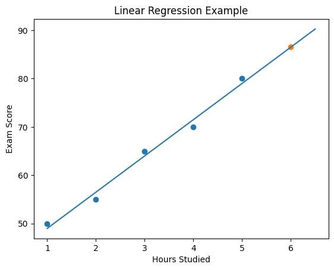

# Linear Regression: A Step-by-Step Mathematical Walkthrough

This document provides a detailed, calculation-oriented explanation of simple linear regression. We'll work through a concrete example and show every mathematical step, using proper statistical notation with HTML tags for subscripts and superscripts where appropriate, and LaTeX for complex equations.

---

## 1. What is Linear Regression?

Linear regression models the relationship between:

- **Independent variable (predictor/feature)**: denoted as <em>X</em>
- **Dependent variable (response/target)**: denoted as <em>Y</em>

The goal is to find a straight line that best describes this relationship, allowing us to **predict** <em>Y</em> for new values of <em>X</em>.

The linear equation is:

<em>ŷi = b0 + b1 xi</em>

where:

- <em>ŷi</em> = predicted value for the i‑th observation
- <em>xi</em> = observed predictor value
- <em>b1</em> = slope (change in predicted <em>Y</em> per unit change in <em>X</em>)
- <em>b0</em> = intercept (predicted <em>Y</em> when <em>X</em> = 0)

The **"best" line** minimizes the sum of squared vertical distances between the observed data points and the line – this is the **ordinary least squares (OLS)** criterion.

---

## 2. Example Dataset

We use a simple real‑world scenario: predicting exam score from hours studied.

| Hours Studied (<em>xi</em>) | Exam Score (<em>yi</em>) |
| :------------------------------------: | :---------------------------------: |
|                   1                    |                 50                  |
|                   2                    |                 55                  |
|                   3                    |                 65                  |
|                   4                    |                 70                  |
|                   5                    |                 80                  |

Number of observations: <em>n = 5</em>.

---

## 3. Step 1: Compute the Means

The mean of <em>X</em> and <em>Y</em> are needed for the slope and intercept formulas.

<em>x̄ = (1 + 2 + 3 + 4 + 5) / 5 = 15 / 5 = 3.0</em>

<em>ȳ = (50 + 55 + 65 + 70 + 80) / 5 = 320 / 5 = 64.0</em>

---

## 4. Step 2: Recall the OLS Formulas

**Slope** (<em>b1</em>):

$$b_1 = \frac{\sum_{i=1}^{n} (x_i - \bar{x})(y_i - \bar{y})}{\sum_{i=1}^{n} (x_i - \bar{x})^2}$$

**Intercept** (<em>b0</em>):

<em>b0 = ȳ − b1 x̄</em>

These formulas come from minimizing the sum of squared residuals.

---

## 5. Step 3: Build a Computation Table

We calculate each term systematically.

| <em>i</em> | <em>xi</em> | <em>yi</em> | <em>xi − x̄</em> | <em>yi − ȳ</em> | <em>(xi − x̄)(yi − ȳ)</em> | <em>(xi − x̄)2</em> |
| ---------: | ---------------------: | ---------------------: | -------------------------: | -------------------------: | ----------------------------------------------: | ---------------------------------------: |
|          1 |                      1 |                     50 |                         -2 |                        -14 |                                              28 |                                        4 |
|          2 |                      2 |                     55 |                         -1 |                         -9 |                                               9 |                                        1 |
|          3 |                      3 |                     65 |                          0 |                          1 |                                               0 |                                        0 |
|          4 |                      4 |                     70 |                          1 |                          6 |                                               6 |                                        1 |
|          5 |                      5 |                     80 |                          2 |                         16 |                                              32 |                                        4 |
|    **Sum** |                        |                        |                            |                            |                                          **75** |                                   **10** |

---

## 6. Step 4: Calculate the Slope (<em>b1</em>)

<em>b1 = 75 / 10 = 7.5</em>

Thus, for each additional hour studied, the predicted exam score increases by **7.5 points**.

---

## 7. Step 5: Calculate the Intercept (<em>b0</em>)

<em>b0 = ȳ − b1 x̄ = 64.0 − (7.5 × 3.0) = 64.0 − 22.5 = 41.5</em>

The intercept indicates that a student who studies **0 hours** would be predicted to score **41.5**. (In many contexts the intercept may not be interpretable, but it is mathematically necessary.)

---

## 8. Step 6: Write the Final Regression Equation

<em>ŷi = 41.5 + 7.5 xi</em>

For the given data, the predicted values <em>ŷi</em> are:

| <em>xi</em> | <em>yi</em> (actual) | <em>ŷi = 41.5 + 7.5 xi</em> |
| ---------------------: | ------------------------------: | ------------------------------------------------: |
|                      1 |                              50 |                                              49.0 |
|                      2 |                              55 |                                              56.5 |
|                      3 |                              65 |                                              64.0 |
|                      4 |                              70 |                                              71.5 |
|                      5 |                              80 |                                              79.0 |

Notice that the predicted values lie exactly on the line, and the differences (residuals) <em>yi − ŷi</em> are:  
1.0, −1.5, 1.0, −1.5, 1.0. Their sum is zero (as expected).

---

## 9. Step 7: Use the Model for Prediction

**Question**: What exam score would we predict for a student who studies **6 hours**?

<em>ŷ = 41.5 + 7.5 × 6 = 41.5 + 45.0 = 86.5</em>

So the predicted score is **86.5**.

---

## 10. Visual Representation

A plot of the data points and the fitted regression line helps to see the fit.

  
_Scatter plot with regression line and the new prediction at x = 6._

---

## 11. Key Mathematical Insights

- The **slope** formula is derived from the covariance of <em>X</em> and <em>Y</em> divided by the variance of <em>X</em>:  
  <em>b1 = Cov(X,Y) / Var(X)</em>

- The **intercept** ensures that the line passes through the point of means (<em>x̄, ȳ</em>).

- The **least squares** criterion guarantees that the sum of squared residuals is minimized:  
  <em>∑i=1n (yi − ŷi)2 → min</em>

- In our example, the total sum of squares (<em>∑ (yi − ȳ)2</em>) is:  
  <em>(−14)2 + (−9)2 + (1)2 + (6)2 + (16)2 = 196 + 81 + 1 + 36 + 256 = 570</em>

  The regression sum of squares (<em>∑ (ŷi − ȳ)2</em>) is:  
  <em>(49−64)2 + (56.5−64)2 + (64−64)2 + (71.5−64)2 + (79−64)2 = 225 + 56.25 + 0 + 56.25 + 225 = 562.5</em>

  and the residual sum of squares is <em>570 − 562.5 = 7.5</em>. The coefficient of determination <em>R2 = 562.5 / 570 ≈ 0.987</em>, indicating an excellent fit.

---

## 12. Why Linear Regression Matters

Linear regression is a foundational tool in statistics and machine learning. It is used for:

- **Prediction** (sales, prices, demand)
- **Inference** (understanding relationships between variables)
- **Trend analysis** (time series, economics)
- **Risk modeling** (finance, insurance)

Its simplicity, interpretability, and strong theoretical basis make it a first‑choice method in many data analysis tasks.

---

## 13. Summary of Steps

1. Collect paired data (<em>xi, yi</em>).
2. Compute the means <em>x̄</em> and <em>ȳ</em>.
3. Calculate the deviations <em>xi − x̄</em> and <em>yi − ȳ</em>.
4. Compute the sum of products <em>∑ (xi − x̄)(yi − ȳ)</em> and the sum of squares <em>∑ (xi − x̄)2</em>.
5. Obtain the slope using the formula:

   $$b_1 = \frac{\sum_{i=1}^{n} (x_i - \bar{x})(y_i - \bar{y})}{\sum_{i=1}^{n} (x_i - \bar{x})^2}$$

6. Obtain the intercept <em>b0 = ȳ − b1 x̄</em>.
7. Form the regression equation <em>ŷ = b0 + b1 x</em>.
8. Use the equation to predict <em>Y</em> for new <em>X</em> values.

This step‑by‑step procedure embodies the core idea of linear regression: finding the line that best fits the data by minimizing squared errors.
