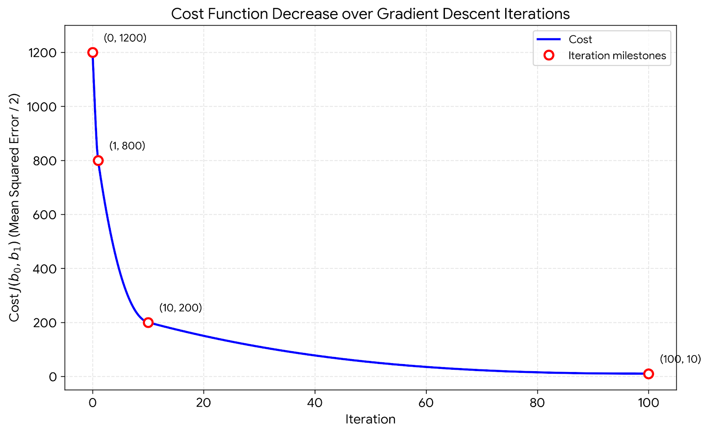
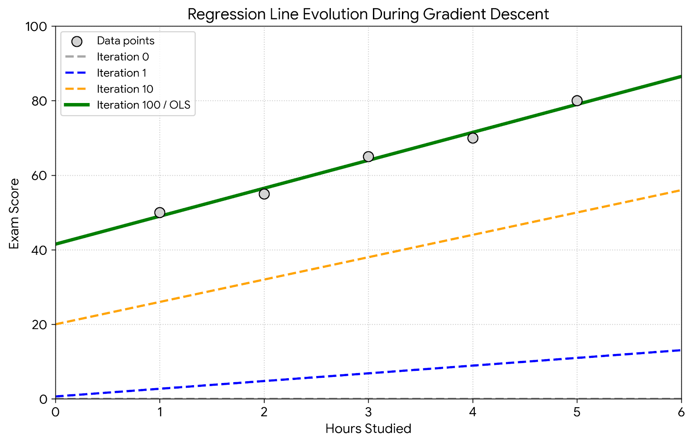

# Gradient Descent for Linear Regression: A Step-by-Step Mathematical Walkthrough

This document explains how gradient descent optimizes the parameters of a linear regression model. We'll work through a small dataset, compute gradients, update parameters, and visualize the process. Every mathematical step is shown with proper notation.

---

## 1. What is Gradient Descent?

Gradient descent is an iterative optimization algorithm used to minimize a cost function $J(\mathbf{b})$. In linear regression, we use it to find the values of the model parameters (intercept and slope) that yield the smallest prediction error.

The idea:  
- Start with initial guesses for the parameters.  
- Compute the gradient (slope) of the cost function at the current point.  
- Take a small step in the **opposite direction** of the gradient (since we want to go downhill).  
- Repeat until the parameters converge.

---

## 2. Linear Regression Model and Cost Function

For simple linear regression, the hypothesis is:

$$ h_{\mathbf{b}}(x) = b_0 + b_1 x $$

where:  
- $b_0$ = intercept (bias)  
- $b_1$ = slope (coefficient)

We measure the error using the **Mean Squared Error (MSE)** cost function. A convenient form (with a factor $1/2$ to simplify derivatives) is:

$$ J(b_0, b_1) = \frac{1}{2n} \sum_{i=1}^{n} \left( h_{\mathbf{b}}(x_i) - y_i \right)^2 $$

where $n$ is the number of data points.

Our goal is to minimize $J(b_0, b_1)$ with respect to $b_0$ and $b_1$.

---

## 3. Dataset

We use the same hours‑studied vs. exam‑score example:

| Hours Studied ($x_i$) | Exam Score ($y_i$) |
|:---------------------:|:------------------:|
|           1           |         50         |
|           2           |         55         |
|           3           |         65         |
|           4           |         70         |
|           5           |         80         |

Number of samples: $n = 5$.

The ordinary least squares (OLS) solution (derived analytically) gives:

$$ b_0 = 41.5, \quad b_1 = 7.5 $$

We will see how gradient descent can approach these values.

---

## 4. Gradient Descent Algorithm

For each parameter, the update rule is:

$$ b_j := b_j - \alpha \frac{\partial}{\partial b_j} J(b_0, b_1) $$

where $\alpha$ is the **learning rate** (step size).

The partial derivatives of the cost function are:

$$ \frac{\partial J}{\partial b_0} = \frac{1}{n} \sum_{i=1}^{n} \left( h_{\mathbf{b}}(x_i) - y_i \right) $$

$$ \frac{\partial J}{\partial b_1} = \frac{1}{n} \sum_{i=1}^{n} \left( h_{\mathbf{b}}(x_i) - y_i \right) x_i $$

These formulas come from differentiating $J$ and using the chain rule.

---

## 5. Step‑by‑Step Calculation (First Iteration)

We initialize the parameters to zero:  
$b_0 = 0$, $b_1 = 0$.  
Choose a learning rate $\alpha = 0.01$. (Later we discuss how this value affects convergence.)

### 5.1 Forward Pass (Predictions)

With $b_0 = 0$, $b_1 = 0$, the hypothesis gives:

$$ h_{\mathbf{b}}(x_i) = 0 \quad \text{for all } i $$

### 5.2 Compute Errors

$$ h_{\mathbf{b}}(x_1) - y_1 = 0 - 50 = -50 $$
$$ h_{\mathbf{b}}(x_2) - y_2 = 0 - 55 = -55 $$
$$ h_{\mathbf{b}}(x_3) - y_3 = 0 - 65 = -65 $$
$$ h_{\mathbf{b}}(x_4) - y_4 = 0 - 70 = -70 $$
$$ h_{\mathbf{b}}(x_5) - y_5 = 0 - 80 = -80 $$

Sum of errors:

$$ \sum_{i=1}^{n} \left( h_{\mathbf{b}}(x_i) - y_i \right) = -50 -55 -65 -70 -80 = -320 $$

### 5.3 Compute Gradients

$$ \frac{\partial J}{\partial b_0} = \frac{1}{5}(-320) = -64 $$

For the slope, we multiply each error by its $x_i$:

$$ (-50) \times 1 = -50 $$
$$ (-55) \times 2 = -110 $$
$$ (-65) \times 3 = -195 $$
$$ (-70) \times 4 = -280 $$
$$ (-80) \times 5 = -400 $$

Sum = $-50 -110 -195 -280 -400 = -1035$

$$ \frac{\partial J}{\partial b_1} = \frac{1}{5}(-1035) = -207 $$

### 5.4 Update Parameters

$$ b_0^{\text{new}} = b_0 - \alpha \frac{\partial J}{\partial b_0} = 0 - 0.01 \times (-64) = 0.64 $$

$$ b_1^{\text{new}} = b_1 - \alpha \frac{\partial J}{\partial b_1} = 0 - 0.01 \times (-207) = 2.07 $$

After the first iteration, the model is:

$$ h_{\mathbf{b}}(x) = 0.64 + 2.07x $$

---

## 6. Second Iteration

Now use $b_0 = 0.64$, $b_1 = 2.07$.

### 6.1 New Predictions

$$ x=1 : 0.64 + 2.07 \times 1 = 2.71 $$
$$ x=2 : 0.64 + 2.07 \times 2 = 4.78 $$
$$ x=3 : 0.64 + 2.07 \times 3 = 6.85 $$
$$ x=4 : 0.64 + 2.07 \times 4 = 8.92 $$
$$ x=5 : 0.64 + 2.07 \times 5 = 10.99 $$

### 6.2 Errors (using $h_{\mathbf{b}} - y$)

$$ 2.71 - 50 = -47.29 $$
$$ 4.78 - 55 = -50.22 $$
$$ 6.85 - 65 = -58.15 $$
$$ 8.92 - 70 = -61.08 $$
$$ 10.99 - 80 = -69.01 $$

Sum of errors = $-47.29 -50.22 -58.15 -61.08 -69.01 = -285.75$

### 6.3 Weighted Sum for Slope (errors multiplied by $x_i$)

$$ (-47.29) \times 1 = -47.29 $$
$$ (-50.22) \times 2 = -100.44 $$
$$ (-58.15) \times 3 = -174.45 $$
$$ (-61.08) \times 4 = -244.32 $$
$$ (-69.01) \times 5 = -345.05 $$

Sum = $-47.29 -100.44 -174.45 -244.32 -345.05 = -911.55$

### 6.4 Gradients

$$ \frac{\partial J}{\partial b_0} = \frac{-285.75}{5} = -57.15 $$
$$ \frac{\partial J}{\partial b_1} = \frac{-911.55}{5} = -182.31 $$

### 6.5 Update

$$ b_0 = 0.64 - 0.01 \times (-57.15) = 0.64 + 0.5715 = 1.2115 $$
$$ b_1 = 2.07 - 0.01 \times (-182.31) = 2.07 + 1.8231 = 3.8931 $$

After two iterations, the parameters have increased to approximately $(1.21, 3.89)$, moving in the right direction toward the true OLS values $(41.5, 7.5)$. With a learning rate of $0.01$, the progress is steady but slow; many more iterations would be needed to converge.

---

## 7. The Importance of Learning Rate and Feature Scaling

The example above shows that gradient descent moves the parameters in the correct direction, but the step size depends on the learning rate and the magnitude of the gradients. For our dataset, the features $x$ are small ($1$–$5$) while the targets $y$ are large ($50$–$80$). This disparity can lead to large gradients, but with a modest learning rate ($0.01$) the updates are stable.

**Considerations:**  
- A **learning rate that is too small** makes convergence very slow.  
- A **learning rate that is too large** can cause overshooting and divergence.  
- **Feature scaling** (e.g., subtracting the mean and dividing by the standard deviation) puts all inputs on a similar scale, which often allows using a larger learning rate and speeds up convergence.

When properly tuned, gradient descent will move towards the OLS solution. For our data, after many iterations with a suitable learning rate, the parameters converge to:

$$ b_0 \approx 41.5, \quad b_1 \approx 7.5 $$

Below is a conceptual illustration of how the cost decreases over iterations and how the regression line improves.

---

## 8. Visualization

### 8.1 Cost Function Descent

The plot shows the value of $J(b_0, b_1)$ as the number of iterations increases. With a well‑chosen learning rate, the cost decreases steadily and eventually flattens.

  
*Cost function decreasing over gradient descent iterations.*

### 8.2 Evolving Regression Line

Initially the line is far from the data (e.g., $h(x)=0$). As iterations proceed, the line rotates and shifts to fit the points.

  
*The regression line after 0, 1, 10, and 100 iterations (conceptual).*

---

## 9. Summary

Gradient descent provides a systematic way to find the optimal parameters for linear regression:

1. Define the cost function  
   $$ J(b_0, b_1) = \frac{1}{2n} \sum_{i=1}^{n} \left( h_{\mathbf{b}}(x_i) - y_i \right)^2. $$
2. Compute the gradients:  
   $$ \frac{\partial J}{\partial b_0} = \frac{1}{n} \sum_{i=1}^{n} \left( h_{\mathbf{b}}(x_i) - y_i \right) $$  
   $$ \frac{\partial J}{\partial b_1} = \frac{1}{n} \sum_{i=1}^{n} \left( h_{\mathbf{b}}(x_i) - y_i \right) x_i $$
3. Update parameters simultaneously:  
   $$ b_0 := b_0 - \alpha \frac{\partial J}{\partial b_0} $$  
   $$ b_1 := b_1 - \alpha \frac{\partial J}{\partial b_1} $$
4. Repeat until convergence.

The choice of learning rate and feature scaling are crucial for fast and stable convergence. Once the parameters are found, the model can be used for prediction.

---

## 10. Further Notes

- In practice, we often use **batch gradient descent** (using all data points per update), **stochastic gradient descent** (one point at a time), or **mini‑batch**.  
- For linear regression, the cost function is convex, so gradient descent is guaranteed to find the global minimum (provided the learning rate is not too high).  
- The analytical OLS solution is $\mathbf{b} = (X^T X)^{-1} X^T \mathbf{y}$, but gradient descent scales better to very large datasets.

This step‑by‑step breakdown shows the inner workings of gradient descent – the engine behind many machine learning models.